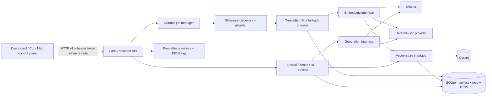

# RepoMesh architecture

## Single-node vertical slice

The API is intentionally separated from the Dashboard. A client sees only the stable `/v1` contract, so a Mac can replace the browser control surface without reaching into Windows files or databases.

## Ingestion and identity

Registration resolves the supplied path, checks it against every configured allowlist root, verifies that it is the Git top-level directory, and stores a deterministic repository UUID. Discovery uses `git ls-files --cached --others --exclude-standard`, then applies defense-in-depth filters for dependency/build directories, secret filenames, binary extensions/content, generated suffixes, and file size.

File state is `(repository_id, relative_path, sha256, commit_sha, vector_synced)`. Chunk identity is UUIDv5 over repository ID, normalized path, exact line range, and content SHA-256. Qdrant is updated idempotently before the SQLite manifest transaction is committed; an unavailable store leaves `vector_synced=false`, forcing a later incremental retry instead of silently skipping the file. Replacing a changed file deletes its old SQLite chunks, inserts new chunks, and upserts its manifest in one transaction. Full reindex therefore replaces per-file data without duplicates; incremental indexing skips matching, vector-synced hashes and explicitly removes deleted paths.

## Chunking

Tree-sitter walks declaration nodes for:

- Python: functions and classes;
- Java: classes, interfaces, methods, constructors;
- JavaScript: functions, generators, classes, methods;
- TypeScript: JavaScript declarations plus interfaces, types, and enums;
- C++: functions, classes, structs, and namespaces.

Oversized symbols are divided into overlapping line windows and marked `tree-sitter-split`. Unsupported or failed parses use `line-fallback`. Every stored chunk includes repository/commit identity, path/language, symbol/kind, one-based inclusive lines, content and hash, reliable import/include lines, model/version, strategy, and vector.

## Retrieval and answers

Lexical retrieval uses a content-linked SQLite FTS5 table. Dense retrieval embeds the query and calls the selected vector-store interface. Hybrid retrieval independently requests the configured lexical and vector candidate counts, then calculates `sum(1 / (rrf_k + rank))`. Search responses retain component scores.

Answers receive hybrid chunks until the character budget is exhausted. The generator is told to use exact supplied source labels. The API removes any citation-looking label not in the retrieved set and appends verified labels if the model omitted them. The response includes both answer text and structured citation/chunk arrays.

## Job reliability

Index jobs are written before execution. Each transition and progress update persists status, counters, attempt, heartbeat, lease expiry, cancellation, and errors. Submission can carry a globally unique idempotency key. On startup, queued/running/retrying jobs return to the local executor; recovery is incremental at file granularity, so successfully manifested files are skipped. Unhandled job errors retry with bounded exponential backoff. File errors are isolated and recorded without aborting the remaining repository.

## Failure domains

- Ollama unavailable: health is degraded when configured; lexical search remains available; embed/dense/hybrid/answer return HTTP 503 with a provider-specific error.
- Qdrant unavailable: the API and FTS5 stay available; indexing retains SQLite chunks and logs deferred vector synchronization; dense/hybrid/answer return HTTP 503.
- Process exit: SQLite WAL retains manifests/jobs. Startup recovery resubmits unfinished jobs.
- File deletion/change: the next incremental pass reconciles the manifest and vector payloads.

## Future two-node design

The Mac control plane may store user-facing workspace definitions, schedule Windows jobs with idempotency keys, poll durable status, aggregate metrics, retain evaluation history, and present richer repository/query management. Windows remains the path-owning compute plane. Network transport stays HTTP v1 over Tailscale with token authentication. Future work may add signed requests, per-client roles, event streaming, and a control-plane scheduler, but not a multi-node Qdrant cluster by implication.
