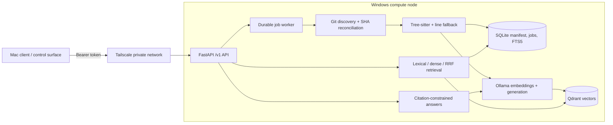

# RepoMesh

[](https://github.com/yangchen1234/repomesh/actions/workflows/ci.yml)
[](LICENSE)
[](https://www.python.org/)

**RepoMesh is a local-first codebase RAG platform that incrementally indexes repositories and provides hybrid code search and cited answers across a private cross-device deployment.**

RepoMesh combines code-aware Tree-sitter chunking, SQLite FTS5, Qdrant, Ollama, and a durable FastAPI worker into a complete Windows-first vertical slice. It runs standalone on one machine and exposes a stable `/v1` API that a Mac or another trusted control surface can call over Tailscale.

## What problem does it solve?

- Large repositories make it difficult to locate implementation details and follow behavior across files.
- Rebuilding an entire semantic index after one changed file is slow and wasteful.
- Lexical search is precise for identifiers while vector search is better at semantic intent; either mode alone has blind spots.
- Private source code should not need to leave hardware the developer controls.
- Long-running indexing needs durable state, cancellation, retry, recovery, and idempotent submission.

## Core capabilities

- **Code-aware ingestion:** allowlisted Git roots, `.gitignore` support, secret/binary/generated-file filtering, and size limits.
- **Tree-sitter chunking:** Python, Java, JavaScript, TypeScript, and C++ symbols, plus explicit line-based fallback for unsupported or failed parses.
- **Incremental reconciliation:** SHA-256 file manifests, deterministic chunk IDs, add/modify/delete handling, and duplicate-safe vector synchronization.
- **Three retrieval modes:** SQLite FTS5 lexical search, Qdrant dense search, and Reciprocal Rank Fusion (RRF) hybrid search.
- **Cited local answers:** Ollama generation constrained to retrieved evidence, with structured citations and `[path:start-end]` labels.
- **Durable jobs:** persisted progress, heartbeat, lease expiry, exponential backoff, per-file isolation, cancellation, restart recovery, and idempotency keys.
- **Compute-node API:** FastAPI, Pydantic, OpenAPI, optional local/required remote token authentication, Prometheus metrics, and JSON logs.
- **Usable dashboard:** node health, repositories, indexing progress, all retrieval modes, cited answers, latency, and degraded-state visibility.
- **Reproducible evaluation:** a committed 25-query fixture corpus and raw benchmark sessions.

## Architecture



The API and dashboard are separate surfaces. Windows owns repository paths, indexing, retrieval, and provider state; remote clients only use versioned HTTP contracts.

## Data flows

### Indexing

1. Register an allowlisted local Git repository.
2. Discover tracked and unignored files, then apply defense-in-depth filters.
3. Compare file SHA-256 values with the SQLite manifest.
4. Chunk only added or changed files by symbol, falling back to bounded line windows.
5. Persist lexical chunks and job/file state in SQLite; embed and upsert vectors in Qdrant.
6. Remove deleted-file chunks from both stores. Re-running the same state produces no duplicate chunk IDs.

### Query and answer

1. Run lexical and/or dense candidate retrieval.
2. For hybrid mode, fuse independent rankings with configurable RRF.
3. Return exact code chunks, component scores, commit SHA, symbol, and one-based line ranges.
4. For `/v1/answer`, fit retrieved evidence into a context budget and ask the local generator to cite only supplied labels.
5. Remove unverified citation-shaped text and return both answer text and structured citations.

## Technology stack

| Area | Implementation |
|---|---|
| API and schemas | FastAPI, Pydantic, Uvicorn |
| Repository metadata and jobs | SQLite WAL |
| Lexical retrieval | SQLite FTS5 |
| Vector retrieval | Qdrant + `qdrant-client` |
| Code parsing | Tree-sitter language pack |
| Local models | Ollama; evaluated with `nomic-embed-text` and `qwen2.5-coder:14b` |
| Fusion | Reciprocal Rank Fusion |
| Observability | Prometheus metrics and structured JSON logging |
| Dashboard | TypeScript, Vite, Vitest |
| Quality | pytest, Ruff, mypy, GitHub Actions |

## Quick start: Windows standalone

Prerequisites: Git, Python 3.12+, Docker Desktop, Node.js LTS, and Ollama.

```powershell
git clone https://github.com/yangchen1234/repomesh.git
Set-Location repomesh
Copy-Item .env.example .env
.\scripts\setup.ps1
```

Start Qdrant and prepare the real models used for the published evaluation:

```powershell
.\scripts\start-dependencies.ps1
ollama pull nomic-embed-text
ollama pull qwen2.5-coder:14b
```

Set these non-secret provider values in `.env`:

```dotenv
REPOMESH_EMBEDDING_PROVIDER=ollama
REPOMESH_EMBEDDING_MODEL=nomic-embed-text
REPOMESH_EMBEDDING_DIMENSIONS=768
REPOMESH_GENERATION_PROVIDER=ollama
REPOMESH_GENERATION_MODEL=qwen2.5-coder:14b
REPOMESH_VECTOR_PROVIDER=qdrant
```

Keep `REPOMESH_HOST=127.0.0.1` for standalone use, set `REPOMESH_REPOSITORY_ROOTS` to the narrowest suitable parent, then start the API and built dashboard:

```powershell
.\scripts\start-api.ps1
```

- Dashboard: <http://127.0.0.1:8787/>
- OpenAPI: <http://127.0.0.1:8787/docs>
- Metrics: <http://127.0.0.1:8787/metrics>

### Register and index a repository

```powershell
$repository = Invoke-RestMethod 'http://127.0.0.1:8787/v1/repositories' `
  -Method Post -ContentType 'application/json' `
  -Body (@{ path = '<REPOSITORY_PATH>'; name = 'example' } | ConvertTo-Json)

$job = Invoke-RestMethod "http://127.0.0.1:8787/v1/repositories/$($repository.id)/index" `
  -Method Post -ContentType 'application/json' `
  -Body (@{ mode = 'full'; idempotency_key = 'quickstart-full-v1'; wait = $true } | ConvertTo-Json)
```

### Compare lexical, dense, and hybrid search

```powershell
foreach ($mode in @('lexical', 'dense', 'hybrid')) {
  Invoke-RestMethod 'http://127.0.0.1:8787/v1/search' `
    -Method Post -ContentType 'application/json' `
    -Body (@{
      repository_id = $repository.id
      query = 'Where is restart recovery implemented?'
      mode = $mode
      top_k = 5
    } | ConvertTo-Json)
}
```

### Request a cited answer

```powershell
Invoke-RestMethod 'http://127.0.0.1:8787/v1/answer' `
  -Method Post -ContentType 'application/json' `
  -Body (@{
    repository_id = $repository.id
    query = 'How are lexical and vector rankings fused?'
    top_k = 6
  } | ConvertTo-Json)
```

The response contains retrieved chunks, structured citations, evidence sufficiency, and retrieval/generation/total latency. Stop the foreground API with `Ctrl+C`, then stop Docker dependencies:

```powershell
.\scripts\stop.ps1
```

## WSL/Linux

```bash
bash scripts/setup.sh
docker compose up -d --wait qdrant
ollama pull nomic-embed-text
ollama pull qwen2.5-coder:14b
.venv/bin/repomesh serve
```

The `Makefile` provides `setup`, `deps`, `models`, `api`, `dashboard`, `test`, `evaluate`, `benchmark`, `demo`, and `down` targets.

## Private cross-device deployment

Tailscale is the preferred transport because RepoMesh v1.0 does not terminate TLS itself. Never commit or paste real addresses or credentials into documentation.

Windows `.env`:

```dotenv
REPOMESH_HOST=<WINDOWS_TAILSCALE_IP>
REPOMESH_PORT=8787
REPOMESH_API_TOKEN=<REPOMESH_API_TOKEN>
REPOMESH_REPOSITORY_ROOTS=["<REPOSITORY_PATH>"]
```

The native launcher rejects wildcard binds and requires a token for every non-loopback bind. In an elevated PowerShell, allow only the Mac Tailscale address:

```powershell
.\scripts\configure-remote-firewall.ps1 `
  -BindIP '<WINDOWS_TAILSCALE_IP>' `
  -RemoteAddress '<MAC_TAILSCALE_IP>' `
  -Port 8787
```

On the Mac:

```bash
export REPOMESH_BASE_URL='http://<WINDOWS_TAILSCALE_IP>:8787'
read -s REPOMESH_API_TOKEN && export REPOMESH_API_TOKEN
python3 scripts/test-remote-client.py
unset REPOMESH_API_TOKEN
```

The smoke client calls health, capabilities, repositories, and hybrid search; it never prints the token and returns nonzero on network or authentication failure. The v1.0 release was also verified with a real authenticated Mac → Tailscale → Windows hybrid-search smoke (`status=passed`, exit code `0`). See the complete [Mac handoff](docs/MAC_CONTROL_PLANE_HANDOFF.md).

## Evaluation

The committed ParcelFlow fixture supplies 25 single-file, cross-file, symbol, architecture, and implementation-location queries. The published session used Ollama `nomic-embed-text` embeddings (768 dimensions) and Qdrant 1.15.4.

| Retrieval mode | Recall@3 | Recall@5 | MRR@10 | nDCG@10 | Hit rate |
|---|---:|---:|---:|---:|---:|
| Lexical | 0.880 | **0.960** | 0.776 | 0.827 | 0.960 |
| Dense | 1.000 | **1.000** | 1.000 | 1.000 | 1.000 |
| Hybrid RRF | 1.000 | **1.000** | 0.933 | 0.950 | 1.000 |

## Local benchmark

These are measured results from one Windows 11 workstation using Docker Desktop, Qdrant 1.15.4, and local Ollama. They are evidence for this run, not capacity guarantees for other hardware.

| Operation | Observed result |
|---|---:|
| Full index | 28.854 s; 69 files; 442 chunks |
| Full throughput | 2.39 files/s; 15.32 chunks/s |
| Incremental add + modify + delete | 0.951 s; 2 indexed; 1 deleted; 0 errors |
| One-file incremental update | 0.374 s; 1 indexed; 68 skipped |
| One-file/full wall-time ratio | 77.25× |
| Hybrid query concurrency 1 | p50 249.40 ms; p95 2319.92 ms |
| Hybrid query concurrency 5 | p50 513.07 ms; p95 642.79 ms |
| Hybrid query concurrency 10 | p50 935.61 ms; p95 1122.08 ms |

The concurrency-1 p95 retains the first-query Ollama warm-up cost. Full context, hardware metadata, methodology, and raw results are in [BENCHMARKS.md](BENCHMARKS.md) and [`benchmarks/results.json`](benchmarks/results.json).

Reproduce either the deterministic baseline or real-provider run:

```powershell
.\scripts\evaluate.ps1
.\scripts\benchmark.ps1

.\scripts\evaluate.ps1 --embedding-provider ollama --vector-provider qdrant --embedding-dimensions 768
.\scripts\benchmark.ps1 --embedding-provider ollama --vector-provider qdrant --embedding-dimensions 768
```

## Reliability behavior

- **Lease recovery:** unfinished queued/running/retrying jobs are recovered at startup and resume incrementally.
- **Idempotency:** reusing an idempotency key for the same logical request returns the original job; conflicting reuse is rejected.
- **Per-file isolation:** a failed file increments errors without aborting unrelated files.
- **Degraded mode:** health distinguishes provider outages from API unavailability.
- **Lexical fallback:** FTS5 remains usable when Ollama or Qdrant is offline.
- **Incremental correctness:** tests cover add, modify, delete, vector-sync retry, and duplicate prevention.

## Security model

- Loopback is the default; native wildcard binding is rejected.
- Remote binding requires an exact interface IP and non-empty API token.
- Repository paths must resolve inside configured allowlist roots and be Git top levels.
- Discovery ignores common secrets, binaries, generated assets, dependencies, build outputs, and oversized files.
- Tokens are read from environment configuration, compared in constant time, and excluded from request logs.
- Docker-published ports are host-loopback only by default.
- Remote HTTP must stay inside Tailscale or another trusted encrypted overlay with a source-scoped firewall rule.
- RepoMesh is a trusted single-user compute node, not a hostile-code sandbox.

See [SECURITY.md](SECURITY.md) for reporting and deployment guidance.

## Testing

```powershell
.\scripts\test.ps1
```

That command runs backend pytest, Ruff, mypy, frontend Vitest, TypeScript checking, and the Vite production build. CI runs the same quality gates on every push and pull request. Docker validation uses:

```powershell
docker compose build api
docker compose up -d --wait qdrant
docker compose ps
```

There is no Alembic dependency: schema creation and FTS5 setup are versioned directly in [`src/repomesh/db.py`](src/repomesh/db.py).

## Known limitations

- One compute node; no HA claims and no Qdrant cluster.
- SQLite manifests/jobs and Qdrant vectors are node-local state.
- One static node token; no rotation protocol, RBAC, or multi-tenancy.
- No remote hostile-code sandboxing; repository access assumes a trusted operator.
- Tree-sitter declaration coverage is intentionally focused; unsupported or unusual syntax uses line fallback.
- `qwen2.5-coder:14b` answer generation latency depends on local hardware and model warm-up.
- The Dashboard is intentionally lightweight; a full Mac Control Plane UI is outside v1.0.

## Documentation

- [Architecture](ARCHITECTURE.md)
- [Compute-node protocol](docs/PROTOCOL.md)
- [Windows setup](docs/WINDOWS_SETUP.md)
- [Mac control-plane handoff](docs/MAC_CONTROL_PLANE_HANDOFF.md)
- [Benchmarks](BENCHMARKS.md)
- [Contributing](CONTRIBUTING.md)
- [Third-party notices](THIRD_PARTY_NOTICES.md)

## Originality and license

RepoMesh's application source, schema, chunk identifiers, recovery flow, fusion logic, evaluation corpus, Dashboard, scripts, and documentation were implemented independently. The architecture references listed in [THIRD_PARTY_NOTICES.md](THIRD_PARTY_NOTICES.md) were not copied or adapted.

Copyright © 2026 Yang Chen. RepoMesh is released under the [MIT License](LICENSE). Dependency and model licenses remain governed by their upstream projects.
